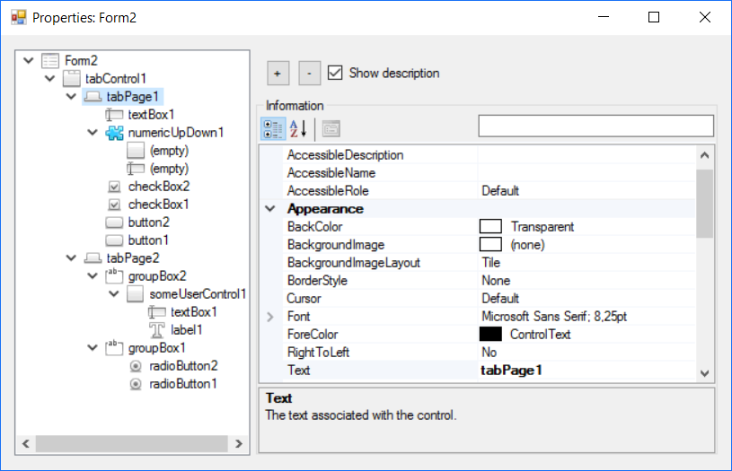
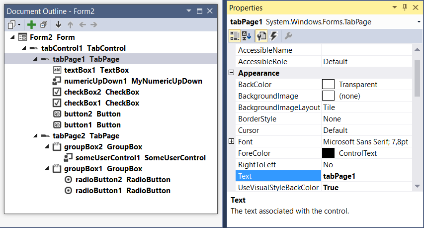

# About
This is project for everyone who are force to work with WinForms :P

It allows to see structure of any form like 'Document Outline' in VisualStudio (*even better: see user controls*).
You can dynamically change value of any property just the same like in designer in VS.

This tool can help you:
- 'How form will looked if I set this property to X'. _Because not every change in designer looks the same when program is running_
- fixing some issues with UI. _sometimes you set everything correct, but some elements are not in right position_
- make some quick changes in UI without changing code. _E.g. When we want change button to be disabled/enabled for screenshot_
- Quick determine how the form or control is named. _In big projects we cannot know every form/control name, so open form in running program and just check name in FormInfo_

# Screenshots
How FormInfo looks?

How standard VisualStudio Outline looks?

# How to use it?
Just add reference to `System.Windows.Forms.Info.dll` and as first line in `Main()` in `Program.cs` (before any other action) put this line:
`System.Windows.Forms.Info.FormInfo.RegisterMessageFilter();`

Now use your program as usual. Every time you want open FormInfo press `Ctrl + Shift + RightMouseClick`

---

If you want know more about or want to customize images, see Wiki page.

# What next?
Project was created just simply for one purpose: _"How can I find this form/control in code"_ :P But there is always something more to add.

This is list, what I plan to do next. Fill free to help and contribute :)
- **Injector** - for now you have to change code to enable FormInfo. Injector will allows you to inject FormInfo into any .NET application without changing any code
- **diff with original** - fixing some issue with UI can take some time and after finding right values, now we have to change them in designer. But what we really change? :)
- **upgrade .NET version** - now it's in .NET4.0 and we cannot change it, because we wouldn't be able to use it with some legacy application that has to be compile in 4.0 (e.g. for WinXP). 'Injector' will solve this problem.
